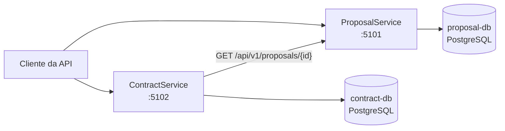
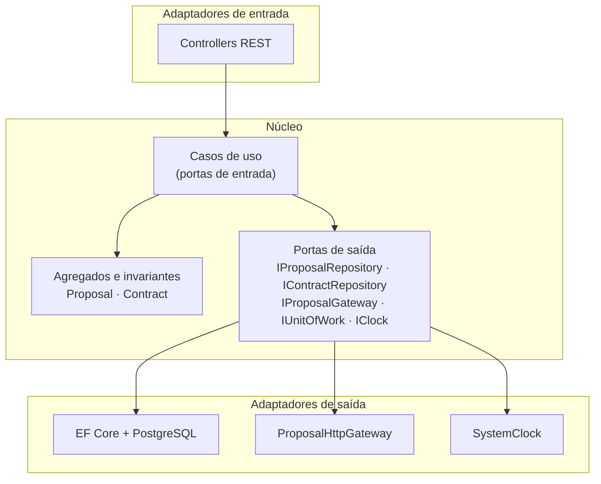
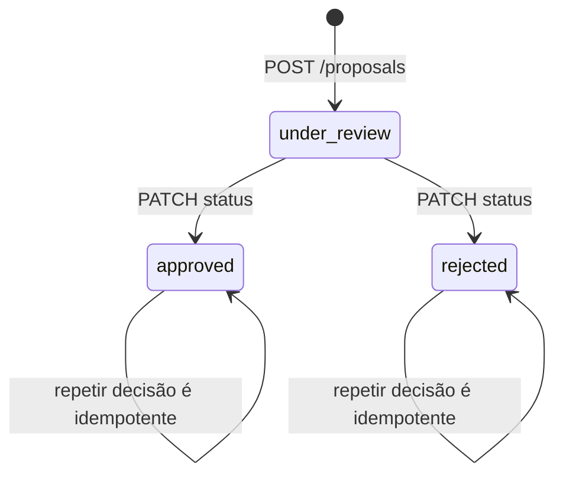
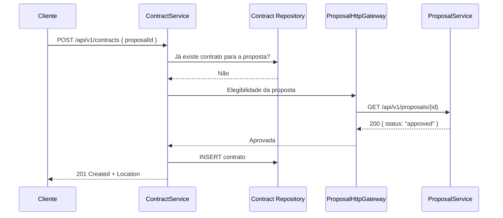
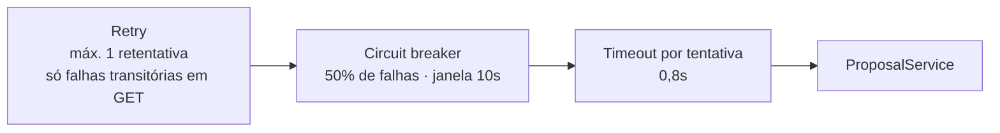
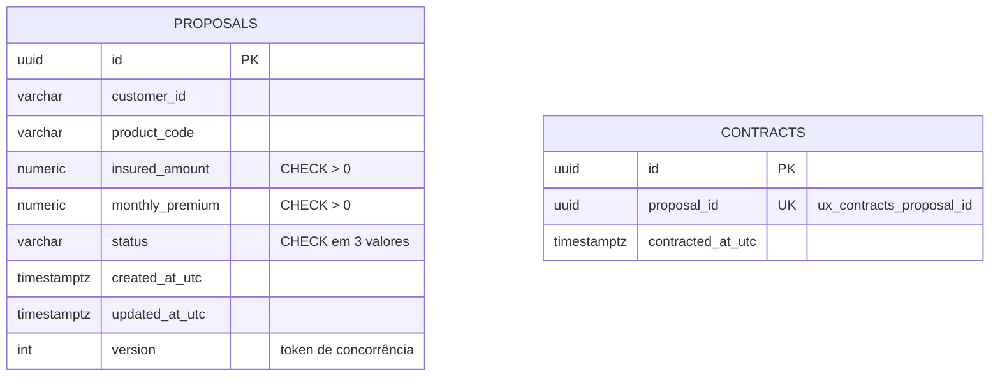

# Insurance Platform

Plataforma de seguros com dois microserviços independentes em **C# / .NET 8**, construídos em **arquitetura hexagonal
(Ports & Adapters)**: um gerencia o ciclo de vida das propostas, o outro registra a contratação de propostas aprovadas.

Os nomes `PropostaService` e `ContratacaoService` do enunciado aparecem no código como `ProposalService` e
`ContractService` — os mesmos microserviços, com nomenclatura consistente em inglês. Os três status correspondem a
`under_review` (Em Análise), `approved` (Aprovada) e `rejected` (Rejeitada).

| Item | Decisão |
| --- | --- |
| Estilo | Arquitetura hexagonal por microserviço |
| Runtime | .NET 8 |
| Persistência | PostgreSQL 16, um banco exclusivo por serviço |
| Comunicação entre serviços | HTTP REST síncrono |
| Migrations | EF Core versionadas (sem `EnsureCreated`) |
| Contrato de erro | RFC 7807 `ProblemDetails` com `code` e `traceId` |
| Execução local | Docker Compose, um comando |
| Testes | 125 automatizados: domínio, aplicação, arquitetura, integração com PostgreSQL real e smoke end-to-end |

---

## Subir e usar

Pré-requisitos: Docker com Compose v2. Nada mais precisa estar instalado.

```bash
docker compose up --build --wait
```

| Serviço | API | Swagger | Health |
| --- | --- | --- | --- |
| ProposalService | http://localhost:5101 | /swagger | /health/live e /health/ready |
| ContractService | http://localhost:5102 | /swagger | /health/live e /health/ready |

Fluxo completo ponta a ponta, em 8 passos, com asserções em cada um:

```bash
./scripts/smoke-test.sh
```

No Windows, o equivalente é `./scripts/smoke-test.ps1`. Para encerrar, `docker compose down` (acrescente `-v` apenas se
quiser descartar os volumes dos bancos).

---

## Arquitetura

### Visão de contexto

Dois processos implantáveis de forma independente, cada um dono exclusivo do seu banco. O `ContractService` não conhece
tabelas nem tipos do `ProposalService`: apenas o contrato HTTP versionado.



### O hexágono de cada serviço

O domínio fica no centro e não conhece HTTP, EF Core ou PostgreSQL. A aplicação define as **portas**; a infraestrutura e
a API são **adaptadores**. A direção das dependências é verificada por testes de arquitetura que falham o build.



Regra de dependência, garantida por `ArchitectureTests`:

```text
Domain  <-  Application  <-  Api
   ^            ^             |
   |            |             v
   +---------- Infrastructure
```

`Domain` não referencia ASP.NET Core, EF Core nem Npgsql. `Application` depende só de `Domain`. Nenhum serviço
referencia assemblies do outro.

### Ciclo de vida da proposta

Os dois estados de decisão são terminais. Isso elimina a janela em que uma proposta poderia deixar de estar aprovada
durante uma contratação.



Repetir a decisão já aplicada devolve o recurso atual sem alterar data ou versão; tentar inverter uma decisão terminal
devolve `409 invalid_status_transition`. Decisões simultâneas são arbitradas por concorrência otimista na coluna
`version`.

### Fluxo crítico: contratação

A ordem das etapas é deliberada — duplicidade local primeiro (evita chamada remota desnecessária), elegibilidade no
instante da solicitação (a decisão precisa ser atual) e persistência por último (nada é gravado se a dependência falhar).



Cada resposta remota tem um destino determinístico, e **nenhuma falha resulta em contratação**:

| Resposta do ProposalService | Resultado da contratação |
| --- | --- |
| `approved` | `201 Created` |
| `under_review` ou `rejected` | `409 proposal_not_approved` |
| `404` | `404 proposal_not_found` |
| Timeout, erro de rede, `5xx`, circuito aberto | `503 proposal_service_unavailable` |
| `4xx` inesperado, JSON inválido, corpo vazio, `id` divergente | `502 proposal_service_invalid_response` |

### Resiliência da chamada remota

O cliente HTTP é tipado e registrado por `HttpClientFactory`, com um pipeline de três camadas:



O orçamento **total** é de 2 segundos, retentativas incluídas; o timeout por tentativa existe para que uma dependência
lenta ainda deixe espaço para a segunda tentativa. O `CancellationToken` do chamador atravessa todo o pipeline e um
cancelamento nunca é retentado. Não existe fallback que considere uma proposta aprovada.

### Concorrência

Duas garantias, ambas exercitadas por testes de integração com PostgreSQL real:

- **Duas decisões para a mesma proposta** — a coluna `version` é token de concorrência; quem perde o `UPDATE` relê o
  estado. Se o estado persistido já é o solicitado, a resposta é sucesso idempotente; se é o oposto, `409
  proposal_concurrency_conflict`.
- **Duas contratações para a mesma proposta** — ambas podem ler a proposta antes de qualquer commit, então a proteção
  final é o índice único `ux_contracts_proposal_id`. O adaptador reconhece essa violação específica e a traduz para
  `409 contract_already_exists`; qualquer outro erro de banco não é mascarado como duplicidade.

---

## API

Base paths `/api/v1/proposals` e `/api/v1/contracts`. JSON em `camelCase`, status em `snake_case`, datas ISO 8601 UTC,
dinheiro como decimal (`numeric(18,2)`), IDs em UUID.

| Método | Rota | Resultado |
| --- | --- | --- |
| `POST` | `/api/v1/proposals` | `201` com a proposta em `under_review` e header `Location` |
| `GET` | `/api/v1/proposals/{id}` | `200` ou `404 proposal_not_found` |
| `GET` | `/api/v1/proposals?status=&page=&pageSize=` | `200` paginado (padrão 20, máximo 100) |
| `PATCH` | `/api/v1/proposals/{id}/status` | `200`, `409 invalid_status_transition` ou `409 proposal_concurrency_conflict` |
| `POST` | `/api/v1/contracts` | `201`, `404`, `409`, `502` ou `503` conforme a tabela de elegibilidade |
| `GET` | `/api/v1/contracts/{id}` | `200` ou `404 contract_not_found` |
| `GET` | `/api/v1/contracts/by-proposal/{proposalId}` | `200` ou `404 contract_not_found` |

Erros seguem RFC 7807 em `application/problem+json`, sempre com um `code` estável para o cliente e `traceId` para
correlação com os logs:

```json
{
  "type": "https://errors.insurance.local/proposal-not-approved",
  "title": "Proposal is not approved",
  "status": 409,
  "detail": "Only approved proposals can be contracted.",
  "instance": "/api/v1/contracts",
  "code": "proposal_not_approved",
  "traceId": "00-f4c8d8c7d7d59f1d58b40ce4cb134c7a-9c638a7b7b0a8f50-01"
}
```

O contrato completo, com payloads e exemplos, está em [`docs/04-API-CONTRACTS.md`](docs/04-API-CONTRACTS.md) — e um
teste automatizado compara o documento OpenAPI publicado com essa especificação, de modo que endpoint novo ou código de
resposta divergente quebra o build.

---

## Dados

Cada serviço tem banco, migrations e histórico `__EFMigrationsHistory` próprios. Não há foreign key entre os contextos:
`contracts.proposal_id` é uma referência lógica.



---

## Testes

```bash
dotnet restore InsurancePlatform.sln
dotnet format InsurancePlatform.sln --verify-no-changes --no-restore
dotnet build InsurancePlatform.sln -c Release --no-restore
dotnet test InsurancePlatform.sln -c Release --no-build
```

Os testes de integração sobem PostgreSQL real via Testcontainers, então o Docker precisa estar disponível para a suíte
completa; unidade e arquitetura rodam sem ele.

| Suíte | Testes | O que prova |
| --- | :---: | --- |
| `ProposalService.UnitTests` | 35 | Invariantes do agregado, transições, idempotência, mapeamento de erros dos casos de uso |
| `ContractService.UnitTests` | 41 | Regras de contratação, mapeamento do gateway e o pipeline real de retry, circuit breaker e timeout |
| `ArchitectureTests` | 26 | Direção das dependências, isolamento entre serviços, adaptadores no lugar certo |
| `ProposalService.IntegrationTests` | 11 | Migrations em banco vazio, endpoints, precisão decimal, concorrência, contrato OpenAPI, prontidão |
| `ContractService.IntegrationTests` | 12 | Migrations, elegibilidade ponta a ponta, corrida no índice único, contrato OpenAPI, prontidão |
| `scripts/smoke-test.*` | 8 passos | Os dois serviços e os dois bancos reais sobre o Compose |

A estratégia completa está em [`docs/05-TEST-STRATEGY.md`](docs/05-TEST-STRATEGY.md).

---

## Operação

| Configuração | ProposalService | ContractService |
| --- | --- | --- |
| Connection string | `ConnectionStrings__ProposalDb` | `ConnectionStrings__ContractDb` |
| Dependência remota | — | `ProposalApi__BaseUrl` |
| Orçamento da chamada | — | `ProposalApi__TimeoutSeconds` (2), `ProposalApi__AttemptTimeoutSeconds` (0,8), `ProposalApi__RetryCount` (1) |
| Migrations no boot | `Database__MigrateOnStartup` | `Database__MigrateOnStartup` |

Configuração inválida impede a inicialização com mensagem clara (`ValidateOnStart`). `.env.example` traz os valores
locais; o Compose funciona sem nenhum arquivo extra e `.env` está no `.gitignore`. `MigrateOnStartup` é conveniência de
desenvolvimento — em produção a migration roda como etapa separada, antes de substituir as instâncias.

Health checks separam vivacidade de prontidão: `/health/live` não toca dependências e `/health/ready` verifica o banco
local. A indisponibilidade do `ProposalService` **não** derruba a prontidão do `ContractService` — ela se manifesta como
`503` na contratação, não como reinicialização em cascata. Logs são estruturados em JSON, com `Service`, `Environment`,
`TraceId` e `EventId`, e nunca incluem payload completo, connection string ou credenciais.

Detalhes em [`docs/06-DELIVERY-AND-OPERATIONS.md`](docs/06-DELIVERY-AND-OPERATIONS.md).

---

## Decisões e trade-offs

- **HTTP síncrono para elegibilidade.** A contratação consulta a proposta no instante da solicitação. Ganha-se uma regra
  imediatamente consistente e fácil de demonstrar; paga-se com dependência de disponibilidade, mitigada por timeout,
  retentativa limitada, circuit breaker e `503` fail-closed.
- **Banco por serviço.** Autonomia e migrations independentes, ao custo de não haver joins nem transações entre os
  contextos — o que é intencional, não uma limitação.
- **Sem mensageria no caminho obrigatório.** RabbitMQ com Outbox é o bônus previsto; um evento futuro serviria para
  integração, nunca como segunda fonte de verdade para autorizar contratação.
- **Sem mediator.** Casos de uso explícitos, sem uma camada de indireção que só encaminha chamadas.
- **DTOs próprios na borda.** A API não serializa tipos de domínio: renomear um membro do enum não pode mudar o contrato
  publicado em silêncio.

## Limitações assumidas

- Sem autenticação ou autorização — fora do escopo do enunciado, e declarado também no OpenAPI.
- Sem exclusão de propostas ou contratos, sem cotação, pagamento, apólice, cancelamento ou endosso.
- Sem Kubernetes, service mesh ou provisionamento em nuvem.
- A mensageria permanece como evolução, com o desenho já registrado em `docs/06`.

## Estrutura

```text
src/
  ProposalService/{Domain,Application,Infrastructure,Api}
  ContractService/{Domain,Application,Infrastructure,Api}
tests/
  ProposalService.{UnitTests,IntegrationTests}
  ContractService.{UnitTests,IntegrationTests}
  ArchitectureTests
scripts/smoke-test.{sh,ps1}
docs/01..06
docker-compose.yml · .env.example · InsurancePlatform.sln
```

| Documento | Conteúdo |
| --- | --- |
| [`docs/01-SCOPE-AND-DECISIONS.md`](docs/01-SCOPE-AND-DECISIONS.md) | Escopo, regras de negócio e rastreabilidade do enunciado |
| [`docs/02-ARCHITECTURE.md`](docs/02-ARCHITECTURE.md) | Componentes, dependências, fluxos e ADRs |
| [`docs/03-DOMAIN-AND-DATA.md`](docs/03-DOMAIN-AND-DATA.md) | Agregados, portas, tabelas, concorrência e migrations |
| [`docs/04-API-CONTRACTS.md`](docs/04-API-CONTRACTS.md) | Endpoints, payloads, erros e OpenAPI |
| [`docs/05-TEST-STRATEGY.md`](docs/05-TEST-STRATEGY.md) | Pirâmide de testes e matriz de cenários |
| [`docs/06-DELIVERY-AND-OPERATIONS.md`](docs/06-DELIVERY-AND-OPERATIONS.md) | Docker, configuração, migrations, saúde e observabilidade |
