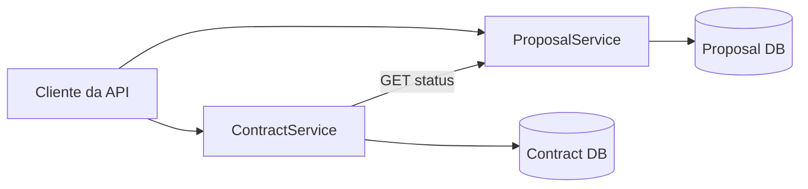
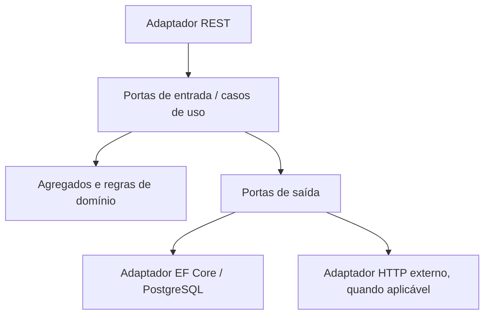
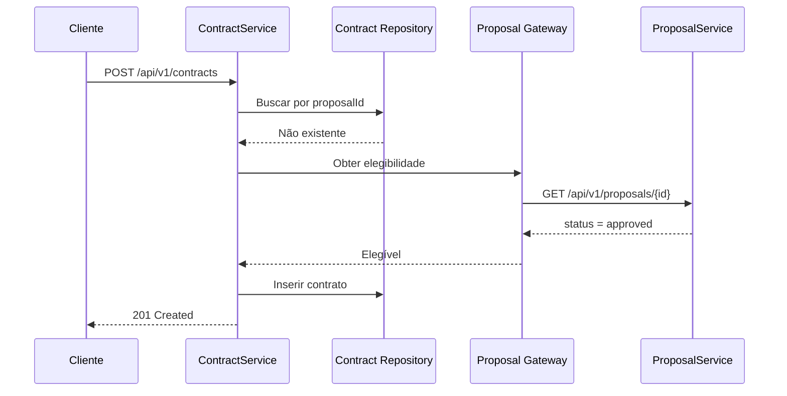

# 02 - Arquitetura da solução

## 1. Visão de contexto



Os dois serviços são processos implantáveis de forma independente. O `ContractService` não compartilha código de domínio nem tabelas com o `ProposalService`; ele conhece apenas o contrato HTTP versionado.

## 2. Bounded contexts

| Contexto | Responsabilidade | Dono da verdade |
| --- | --- | --- |
| Proposal Management | Ciclo de vida e decisão de propostas | `ProposalService` |
| Contracting | Elegibilidade no instante da solicitação e registro da contratação | `ContractService` |

Uma proposta aprovada é um fato externo ao contexto de contratação. O adaptador HTTP traduz o DTO remoto para o modelo mínimo `ProposalEligibility` usado pela aplicação. Isso funciona como uma camada anticorrupção: nomes ou detalhes internos do outro serviço não entram no domínio local.

## 3. Hexágono de cada serviço



### Dependências permitidas

```text
Domain <- Application <- Api
   ^          ^          |
   |          |          v
   +------ Infrastructure
```

- `Domain`: zero dependência de ASP.NET Core, EF Core, Npgsql ou transporte.
- `Application`: depende apenas de `Domain`; define portas e orquestra casos de uso.
- `Infrastructure`: implementa portas da aplicação e pode depender de `Application` e `Domain`.
- `Api`: é o adaptador de entrada e composition root; referencia `Application` e registra `Infrastructure`.
- Referências inversas são proibidas e verificadas por testes de arquitetura.

## 4. Estrutura física recomendada

```text
src/ProposalService/
  ProposalService.Domain/
    Proposals/Proposal.cs
    Proposals/ProposalId.cs
    Proposals/ProposalStatus.cs
    Common/DomainException.cs
  ProposalService.Application/
    Abstractions/IProposalRepository.cs
    Abstractions/IUnitOfWork.cs
    Abstractions/IClock.cs
    Proposals/Create/CreateProposal.cs
    Proposals/GetById/GetProposalById.cs
    Proposals/List/ListProposals.cs
    Proposals/ChangeStatus/ChangeProposalStatus.cs
  ProposalService.Infrastructure/
    Persistence/ProposalDbContext.cs
    Persistence/Configurations/ProposalConfiguration.cs
    Persistence/Repositories/ProposalRepository.cs
    Persistence/Migrations/
    Time/SystemClock.cs
    DependencyInjection.cs
  ProposalService.Api/
    Controllers/ProposalsController.cs
    Contracts/
    ErrorHandling/
    Program.cs

src/ContractService/
  ContractService.Domain/
    Contracts/Contract.cs
    Contracts/ContractId.cs
    Common/DomainException.cs
  ContractService.Application/
    Abstractions/IContractRepository.cs
    Abstractions/IProposalGateway.cs
    Abstractions/IUnitOfWork.cs
    Abstractions/IClock.cs
    Contracts/Create/CreateContract.cs
    Contracts/GetById/GetContractById.cs
    Contracts/GetByProposal/GetContractByProposal.cs
  ContractService.Infrastructure/
    Persistence/ContractDbContext.cs
    Persistence/Configurations/ContractConfiguration.cs
    Persistence/Repositories/ContractRepository.cs
    Persistence/Migrations/
    ProposalApi/ProposalHttpGateway.cs
    ProposalApi/ProposalApiOptions.cs
    Time/SystemClock.cs
    DependencyInjection.cs
  ContractService.Api/
    Controllers/ContractsController.cs
    Contracts/
    ErrorHandling/
    Program.cs
```

Pastas podem ser refinadas, mas os limites e a direção das dependências não podem mudar sem decisão explícita.

## 5. Padrões aplicados

| Padrão | Aplicação concreta |
| --- | --- |
| Ports & Adapters | Interfaces na aplicação; REST, EF Core e HTTP como adaptadores |
| Aggregate | `Proposal` protege transições; `Contract` protege sua criação |
| Repository | Abstrai persistência de cada agregado |
| Unit of Work | Delimita a transação do caso de uso |
| Factory method | `Proposal.Create` e `Contract.Create` garantem invariantes |
| Anti-Corruption Layer | `ProposalHttpGateway` converte resposta remota em elegibilidade local |
| Dependency Injection | Composition root em cada API |
| Result/Error model | Casos de uso retornam resultados tipados; API converte para HTTP |
| DTOs de borda | `Api/Contracts` define request/response próprios; tipos de Domínio e Application não são serializados |

Não será utilizado um mediator apenas para encaminhar uma chamada de controller para uma classe. Casos de uso explícitos reduzem magia e deixam o teste técnico mais legível.

## 6. Fluxo de criação e decisão de proposta

1. O controller valida a forma básica do request e cria o comando.
2. O caso de uso cria o agregado por `Proposal.Create(...)`.
3. O domínio valida invariantes e define `under_review` e timestamps.
4. O repositório adiciona o agregado e a unidade de trabalho confirma a transação.
5. A API devolve `201 Created` e `Location` para a consulta por ID.
6. Na mudança de status, o caso de uso carrega o agregado e chama `Approve` ou `Reject`; o controller nunca altera propriedades diretamente.

## 7. Fluxo crítico de contratação



### Ordem deliberada

1. Verificar duplicidade local primeiro evita uma chamada remota desnecessária.
2. Consultar a proposta no momento da solicitação garante decisão atual.
3. Persistir por último evita contratos quando a dependência falha.
4. O índice único em `proposal_id` resolve a corrida entre duas requisições que passaram simultaneamente pela primeira verificação.

## 8. Consistência e transações

- Cada caso de uso grava em apenas um banco; portanto, não há transação distribuída.
- A mudança de status do `ProposalService` é uma transação local.
- A criação do contrato é uma transação local depois de uma leitura remota.
- Como `approved` é terminal, uma resposta aprovada não pode ser invalidada por uma mudança posterior de status no MVP.
- Uma falha depois do commit e antes da resposta pode levar o cliente a repetir o POST; a restrição única evita duplicação e a API devolve conflito de maneira determinística.

## 9. Comunicação HTTP e resiliência

O `ContractService` usa um typed client registrado por `HttpClientFactory`.

- Base URL vem de `ProposalApi__BaseUrl`.
- Timeout total recomendado: 2 segundos em ambiente local/teste, configurável.
- Timeout por tentativa configurável (padrão 0,8 s) dentro do orçamento total, para que uma dependência lenta ainda deixe espaço para a segunda tentativa.
- Retry: no máximo duas tentativas, apenas para falhas transitórias no `GET` (erro de rede, `5xx` e estouro do timeout da tentativa) e com pequeno jitter.
- Ordem do pipeline: retry por fora, circuit breaker no meio, timeout de tentativa por dentro.
- Circuit breaker: abre após taxa configurada de falhas para evitar cascata.
- O `CancellationToken` da requisição deve chegar ao `HttpClient`.
- `404` remoto vira `proposal_not_found`.
- Timeout, circuito aberto, erro de rede e `5xx` viram `proposal_service_unavailable`.
- `4xx` inesperado e payload inválido viram `proposal_service_invalid_response` e são tratados como `502 Bad Gateway`.
- Nunca usar fallback que marque uma proposta como aprovada.

## 10. Falhas e contrato de erro

Uma única camada de tratamento converte exceções/resultados conhecidos para RFC 7807. Erros não tratados retornam `500` sem stack trace. Cada resposta inclui:

- `type`: URI estável ou `about:blank`.
- `title`: resumo humano.
- `status`: status HTTP.
- `detail`: explicação sem dado sensível.
- `code`: código estável para clientes.
- `traceId`: correlação com logs.

## 11. Segurança proporcional ao escopo

- HTTPS é assumido fora do Compose; redirecionamento pode ser desabilitado no contêiner local.
- Requests têm limites de tamanho padrão e validação de strings/decimais.
- Não registrar payloads, connection strings ou exceções com dados sensíveis.
- Credenciais são fornecidas por variáveis de ambiente.
- Containers rodam como usuário não root quando a imagem final permitir.
- Swagger/OpenAPI fica habilitado no ambiente de desenvolvimento.
- Autenticação não faz parte do MVP; isso deve constar claramente no README de entrega.

## 12. Observabilidade

- Logs estruturados para início/fim de casos de uso, falhas externas e conflitos.
- `traceId` nativo do ASP.NET Core propagado no header W3C `traceparent` pelo `HttpClient`.
- `/health/live`: processo em execução, sem dependências externas.
- `/health/ready`: banco acessível; no `ContractService`, a dependência remota não deve derrubar permanentemente a prontidão, mas pode ter health check informativo separado.
- Métricas/OpenTelemetry são evolução opcional, não requisito para aprovação do MVP.

## 13. Registro resumido das decisões arquiteturais

### ADR-001 - HTTP síncrono para elegibilidade

- **Status:** aceito.
- **Decisão:** o `ContractService` consulta o `ProposalService` no comando de contratação.
- **Consequência positiva:** regra imediatamente consistente e fácil de demonstrar.
- **Consequência negativa:** contratação depende da disponibilidade do serviço de propostas.
- **Mitigação:** timeout, retry limitado, circuit breaker e erro `503` fail-closed.

### ADR-002 - Banco por serviço

- **Status:** aceito.
- **Decisão:** bancos PostgreSQL separados, mesmo que executados no mesmo host em desenvolvimento.
- **Consequência positiva:** autonomia, baixo acoplamento e migrations independentes.
- **Consequência negativa:** não há joins nem transações entre contextos, o que é intencional.

### ADR-003 - Sem mensageria no caminho obrigatório

- **Status:** aceito.
- **Decisão:** RabbitMQ/Outbox somente como bônus posterior.
- **Consequência:** o núcleo permanece pequeno e correto; um evento futuro não vira uma segunda fonte de verdade.

