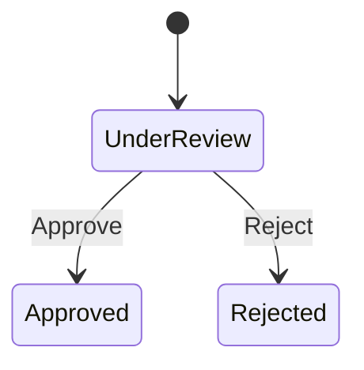

# 03 - Modelo de domínio e dados

## 1. Linguagem ubíqua

| Termo | Definição |
| --- | --- |
| Proposal | Oferta de seguro ainda em análise ou já decidida |
| Under review | Estado inicial; a proposta pode ser aprovada ou rejeitada |
| Approved | Decisão final que torna a proposta elegível para contratação |
| Rejected | Decisão final que impede contratação |
| Contract | Registro imutável de que uma proposta aprovada foi contratada |
| Eligibility | Visão mínima do status da proposta usada pelo contexto de contratação |

No código, os termos são `Proposal`, `ProposalStatus`, `Contract` e `ProposalEligibility`. O nome do segundo serviço é `ContractService`; não usar `HiringService`, pois “contract” expressa melhor o domínio em inglês.

## 2. Agregado Proposal

### Estado

| Campo | Tipo | Regra |
| --- | --- | --- |
| `Id` | `ProposalId` sobre `Guid` | Gerado na criação; nunca vazio |
| `CustomerId` | `string` | 1 a 64 caracteres após `Trim` |
| `ProductCode` | `string` | 1 a 50 caracteres, normalizado para maiúsculas |
| `InsuredAmount` | `decimal` | Maior que zero; escala máxima 2 |
| `MonthlyPremium` | `decimal` | Maior que zero; escala máxima 2 |
| `Status` | `ProposalStatus` | Inicialmente `UnderReview` |
| `CreatedAtUtc` | `DateTimeOffset` | Relógio injetado; UTC |
| `UpdatedAtUtc` | `DateTimeOffset` | Igual à criação no início; muda na decisão |
| `Version` | `int` | Inicia em 1 e suporta concorrência otimista |

### Comportamento

- `Proposal.Create(...)`: valida os dados, normaliza strings, cria ID e define estado inicial.
- `Approve(now)`: muda `UnderReview` para `Approved`, atualiza data e versão.
- `Reject(now)`: muda `UnderReview` para `Rejected`, atualiza data e versão.
- Repetir `Approve` em `Approved` ou `Reject` em `Rejected` é idempotente e não altera data/versão.
- Tentar mudar um estado terminal para o outro gera `invalid_status_transition`.
- Setters são privados; hidratação pelo EF Core usa construtor privado.



Não existe transição de retorno no MVP.

## 3. Agregado Contract

### Estado

| Campo | Tipo | Regra |
| --- | --- | --- |
| `Id` | `ContractId` sobre `Guid` | Gerado no servidor; nunca vazio |
| `ProposalId` | `Guid` | Obrigatório; referência lógica, não FK remota |
| `ContractedAtUtc` | `DateTimeOffset` | Gerado pelo relógio do servidor em UTC |

### Comportamento

- `Contract.Create(proposalId, now)`: rejeita `Guid.Empty` e datas não UTC.
- O agregado é imutável após a criação.
- Elegibilidade e duplicidade são políticas do caso de uso, pois dependem de portas externas.

Não há uma foreign key para `proposals`: os agregados vivem em bancos e bounded contexts distintos.

## 4. Casos de uso e portas

As assinaturas abaixo são guias de responsabilidade; DTOs concretos podem ser `record` imutáveis.

### ProposalService

```csharp
public interface ICreateProposalUseCase
{
    Task<Result<ProposalOutput>> ExecuteAsync(
        CreateProposalCommand command,
        CancellationToken cancellationToken);
}

public interface IProposalRepository
{
    Task AddAsync(Proposal proposal, CancellationToken cancellationToken);

    // Leitura do estado atual, sem enlistar o agregado na transacao em andamento.
    Task<Proposal?> GetByIdAsync(ProposalId id, CancellationToken cancellationToken);

    // Carrega o agregado para que a decisao seja aplicada e confirmada pela unidade de trabalho.
    Task<Proposal?> GetForDecisionAsync(ProposalId id, CancellationToken cancellationToken);

    Task<Page<Proposal>> ListAsync(
        ProposalStatus? status,
        int page,
        int pageSize,
        CancellationToken cancellationToken);
}
```

Portas de entrada mínimas:

- `ICreateProposalUseCase`
- `IGetProposalByIdUseCase`
- `IListProposalsUseCase`
- `IChangeProposalStatusUseCase`

Portas de saída mínimas:

- `IProposalRepository`
- `IUnitOfWork`
- `IClock`

As duas leituras do repositório expressam intenção de negócio, não mecânica do ORM: `GetByIdAsync` devolve o estado
publicado e `GetForDecisionAsync` entrega o agregado que a decisão vai alterar. O adaptador é livre para escolher como
implementa cada uma. `IUnitOfWork` é implementada por uma classe própria da infraestrutura em cada serviço; o
`DbContext` não implementa portas da aplicação.

### ContractService

```csharp
public interface IProposalGateway
{
    Task<ProposalEligibilityResult> GetEligibilityAsync(
        Guid proposalId,
        CancellationToken cancellationToken);
}

public interface IContractRepository
{
    Task AddAsync(Contract contract, CancellationToken cancellationToken);
    Task<Contract?> GetByIdAsync(ContractId id, CancellationToken cancellationToken);
    Task<Contract?> GetByProposalIdAsync(Guid proposalId, CancellationToken cancellationToken);
}
```

Portas de entrada mínimas:

- `ICreateContractUseCase`
- `IGetContractByIdUseCase`
- `IGetContractByProposalUseCase`

Portas de saída mínimas:

- `IContractRepository`
- `IProposalGateway`
- `IUnitOfWork`
- `IClock`

## 5. Modelo de resultados

Falhas esperadas não devem depender de comparar mensagens de exceção. A camada Application usa um `Result<T>` ou união equivalente com códigos tipados.

| Código de aplicação | Origem | HTTP |
| --- | --- | --- |
| `validation_failed` | Input inválido | 400 |
| `proposal_not_found` | Proposta ausente | 404 |
| `invalid_status_transition` | Transição proibida | 409 |
| `proposal_concurrency_conflict` | Outra decisão venceu | 409 |
| `proposal_not_approved` | Proposta inelegível | 409 |
| `contract_not_found` | Contratação ausente | 404 |
| `contract_already_exists` | Duplicidade lógica ou índice único | 409 |
| `proposal_service_unavailable` | Timeout/rede/5xx/circuito aberto | 503 |
| `proposal_service_invalid_response` | Contrato remoto inválido | 502 |

Exceções ficam reservadas a falhas inesperadas ou violações que não deveriam atravessar a aplicação.

## 6. Banco do ProposalService

Tabela lógica `proposals`:

| Coluna | PostgreSQL | Restrições/índices |
| --- | --- | --- |
| `id` | `uuid` | PK |
| `customer_id` | `varchar(64)` | NOT NULL |
| `product_code` | `varchar(50)` | NOT NULL |
| `insured_amount` | `numeric(18,2)` | NOT NULL, CHECK > 0 |
| `monthly_premium` | `numeric(18,2)` | NOT NULL, CHECK > 0 |
| `status` | `varchar(24)` | NOT NULL, CHECK em valores válidos |
| `created_at_utc` | `timestamptz` | NOT NULL |
| `updated_at_utc` | `timestamptz` | NOT NULL |
| `version` | `integer` | NOT NULL, CHECK >= 1, concurrency token |

Índices:

- `ix_proposals_status_created_at` em `(status, created_at_utc desc)`.
- A chave primária já atende busca por ID.

A enumeração é salva como string para tornar os dados legíveis. Renomear um valor exige migration explícita.

## 7. Banco do ContractService

Tabela lógica `contracts`:

| Coluna | PostgreSQL | Restrições/índices |
| --- | --- | --- |
| `id` | `uuid` | PK |
| `proposal_id` | `uuid` | NOT NULL, UNIQUE |
| `contracted_at_utc` | `timestamptz` | NOT NULL |

O índice único `ux_contracts_proposal_id` é requisito de negócio, não apenas otimização. O adaptador de persistência deve reconhecer especificamente essa violação e convertê-la em `contract_already_exists`; outros erros de banco não podem ser mascarados como duplicidade.

## 8. Concorrência

### Duas decisões para a mesma proposta

O campo `version` é configurado como concurrency token. Cada transição incrementa a versão; o `UPDATE` inclui a versão original no predicado. Se duas requisições tentarem aprovar e rejeitar simultaneamente, somente uma confirma e a outra recebe `proposal_concurrency_conflict`.

Quando duas requisições simultâneas pedem **a mesma** decisão, a que perder o update relê a proposta por `GetByIdAsync`. Se o estado persistido já for o solicitado, ela devolve o recurso atual com sucesso idempotente; se o estado for o oposto, devolve conflito. O retry é uma releitura controlada, não uma repetição cega da escrita.

### Duas contratações para a mesma proposta

Ambas podem consultar a proposta antes de qualquer commit. A restrição única garante que apenas uma inserção seja confirmada. O serviço converte a segunda violação em conflito e mantém uma única contratação.

## 9. Migrations

Cada serviço possui seu próprio histórico `__EFMigrationsHistory` no respectivo banco.

Migrations mínimas:

- `ProposalService`: `InitialCreateProposals`.
- `ContractService`: `InitialCreateContracts`.

Regras:

- Migrations vivem no projeto `Infrastructure` correspondente.
- `EnsureCreated` e SQL manual executado na inicialização são proibidos.
- O modelo deve ser validado com um banco vazio em teste de integração.
- Em Compose, uma flag explícita pode permitir `MigrateAsync` para conveniência local.
- Em produção, a migration deve rodar como etapa separada antes do novo processo.

## 10. Consultas e mapeamento

- Consultas de leitura usam `AsNoTracking`.
- Paginação ocorre no banco com ordenação determinística por `created_at_utc desc, id`.
- `page` começa em 1; `pageSize` padrão 20 e máximo 100.
- Entidades EF e agregados podem ser a mesma classe desde que as configurações permaneçam no adaptador e o domínio não receba atributos de persistência.
- API DTOs nunca são retornos diretos do `DbContext`.
