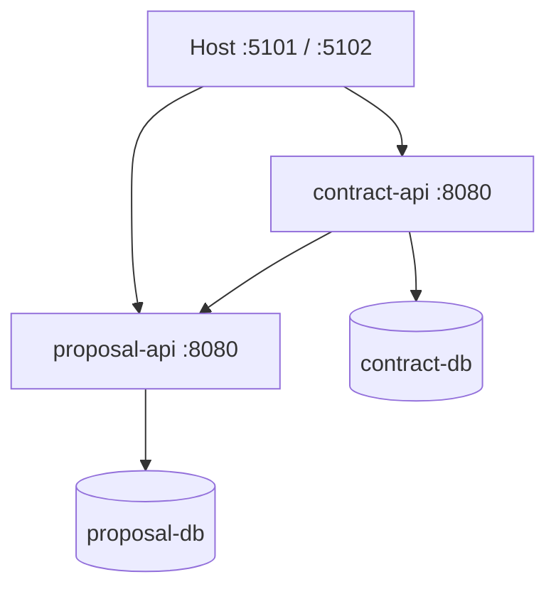

# 06 - Entrega e operação

## 1. Topologia local

O Docker Compose sobe quatro containers obrigatórios:

| Container | Porta publicada | Dependências |
| --- | --- | --- |
| `proposal-api` | `5101 -> 8080` | `proposal-db` saudável |
| `contract-api` | `5102 -> 8080` | `contract-db` saudável; URL do `proposal-api` |
| `proposal-db` | não publicar por padrão | volume próprio |
| `contract-db` | não publicar por padrão | volume próprio |

Os bancos podem usar a mesma imagem PostgreSQL, porém são instâncias/volumes distintos. O `ContractService` recebe `http://proposal-api:8080` por DNS interno do Compose.



## 2. Dockerfiles

Cada API possui Dockerfile multi-stage:

1. Imagem SDK restaura usando os arquivos de solution/projetos e cache eficiente.
2. Build/publish em `Release` para pasta limpa.
3. Imagem runtime `aspnet` recebe apenas o publish.
4. Processo escuta `http://+:8080`.
5. Container usa usuário não root suportado pela imagem .NET.
6. `HEALTHCHECK` pode consultar `/health/live`; o Compose também verifica `/health/ready`.

Não copiar `.env`, arquivos de usuário, resultados de teste ou segredos para a imagem. Um `.dockerignore` deve cobrir `bin/`, `obj/`, `.git/`, `.env` e artefatos locais.

## 3. Configuração

### ProposalService

| Chave | Exemplo local | Obrigatória |
| --- | --- | --- |
| `ASPNETCORE_ENVIRONMENT` | `Development` | Sim |
| `ConnectionStrings__ProposalDb` | fornecida pelo Compose | Sim |
| `Database__MigrateOnStartup` | `true` somente local | Não, padrão `false` |

### ContractService

| Chave | Exemplo local | Obrigatória |
| --- | --- | --- |
| `ASPNETCORE_ENVIRONMENT` | `Development` | Sim |
| `ConnectionStrings__ContractDb` | fornecida pelo Compose | Sim |
| `ProposalApi__BaseUrl` | `http://proposal-api:8080` | Sim |
| `ProposalApi__TimeoutSeconds` | `2` (orçamento total, retries incluídos) | Não |
| `ProposalApi__AttemptTimeoutSeconds` | `0.8` (por tentativa; nunca maior que o total) | Não |
| `ProposalApi__RetryCount` | `1` (0 a 1 retry; no máximo 2 envios) | Não |
| `Database__MigrateOnStartup` | `true` somente local | Não, padrão `false` |

Validar opções no startup com `ValidateOnStart`. Base URL inválida, timeout não positivo ou connection string ausente devem impedir a inicialização com mensagem clara.

`.env.example` contém apenas placeholders e está versionado na raiz; `.env` fica no `.gitignore`. O Compose lê essas
chaves com valores padrão de desenvolvimento (`${POSTGRES_PASSWORD:-postgres}`), então `docker compose up --build --wait`
continua funcionando sem nenhum arquivo extra, e nenhuma credencial real precisa ser versionada.

## 4. Estratégia de migrations

### Desenvolvimento e avaliação

O Compose define `Database__MigrateOnStartup=true`. Cada API:

1. inicia;
2. cria um scope;
3. executa migrations do próprio contexto;
4. só então sinaliza readiness.

Para lidar com o tempo de subida do banco, o Compose usa health checks e `depends_on` com condição de saúde. Uma política curta de retry pode existir apenas no bootstrap de migration.

### Produção

`MigrateOnStartup=false`. A pipeline executa uma etapa/job de migration antes de substituir as instâncias da API. Isso evita múltiplos processos tentando alterar o schema ao mesmo tempo.

## 5. Health checks

| Endpoint | Semântica | Conteúdo externo |
| --- | --- | --- |
| `GET /health/live` | Processo consegue responder | Nenhum banco/HTTP |
| `GET /health/ready` | Serviço pronto para tráfego | Banco local |

Respostas devem ser pequenas e não expor connection string, hostname sensível ou exception. O `ProposalService` remoto não entra na readiness obrigatória do `ContractService`: uma falha transitória deve gerar `503` no caso de uso, sem provocar ciclo constante de reinicialização. Pode existir um health check informativo detalhado somente em desenvolvimento.

## 6. Logs e rastreamento

Campos mínimos de logs importantes:

- `Service`, `Environment`, `TraceId` e `EventId`.
- `ProposalId`/`ContractId` quando relevantes.
- `Outcome` e duração da chamada externa.
- Código do erro de domínio, nunca stack trace em resposta.

Eventos esperados:

- proposta criada e status alterado;
- tentativa de transição inválida;
- contratação criada ou rejeitada por regra;
- falha/timeout/circuit breaker na consulta remota;
- conflito único de contratação;
- migration aplicada ou falha no startup.

Não logar request completo, connection string ou headers de autorização futuros.

## 7. Pipeline de CI recomendada

Ordem:

1. Checkout.
2. Instalar SDK definido em `global.json`.
3. `dotnet restore`.
4. `dotnet format --verify-no-changes`.
5. `dotnet build -c Release --no-restore`.
6. `dotnet test -c Release --no-build` com relatório de cobertura.
7. `docker compose build`.
8. Subir Compose, executar smoke e derrubar os containers mesmo em falha.

O pipeline não publica imagem nem faz deploy; isso está fora do teste.

## 8. Execução que o README final deve ensinar

Pré-requisitos:

- Docker com Compose v2, ou .NET 8 SDK + PostgreSQL para execução manual.

Fluxo de um comando:

```bash
docker compose up --build --wait
```

URLs:

- Proposal API: `http://localhost:5101`
- Proposal Swagger: `http://localhost:5101/swagger`
- Contract API: `http://localhost:5102`
- Contract Swagger: `http://localhost:5102/swagger`

Encerramento:

```bash
docker compose down
```

Remoção de volumes deve ser apresentada como comando separado e claramente destrutivo; nunca fazê-la automaticamente.

## 9. Checklist operacional

- [ ] Ambos os Dockerfiles constroem a partir da raiz sem arquivos locais implícitos.
- [ ] Compose aguarda bancos saudáveis e APIs prontas.
- [ ] Bancos/volumes são separados.
- [ ] Migrations funcionam em volumes vazios e existentes.
- [ ] Swagger reflete o contrato v1.
- [ ] `curl`/script de smoke executa o fluxo completo.
- [ ] Parar e subir novamente preserva dados.
- [ ] Parar `proposal-api` faz contratação falhar fechada com `503`.
- [ ] Logs contêm `traceId` e não contêm segredos.
- [ ] Configuração inválida falha cedo.

## 10. Bônus de mensageria

Somente após todos os gates do MVP:

- Adicionar RabbitMQ ao Compose sob profile `messaging`.
- Gravar evento e alteração da proposta na mesma transação por tabela Outbox.
- Publicador em background envia `ProposalStatusChangedV1` com `eventId`, `occurredAtUtc`, `proposalId`, `previousStatus`, `newStatus` e `version`.
- Consumidores precisam ser idempotentes por `eventId`.
- Falha no broker acumula Outbox e não quebra a alteração de status.
- O `ContractService` não usa o evento como autorização; a consulta HTTP continua obrigatória.
